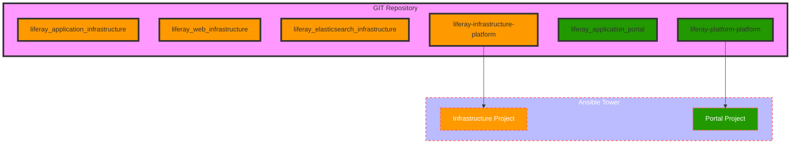

**This contains code that can be used to deploy liferay DXP stack using Ansible.**

*The contents comprise of*

1. Instrastructure
1. Portal

- Infrastructure
   - This folder contains the ansible roles that deploys tasks requiring privileged root access. There are three roles in total.
      - liferay_application_infrastructure
      - liferay_elasticsearch_infrastructure
      - liferay_web_infrastructure
  - This folder also contains the wrapper ansible code required for Ansible project
      - liferay-infrastructure-platform
- Portal
    -  This folder contains the ansible role used to deploy liferay DXP on application servers. The role is liferay_application_portal
    -  The wrapper ansible code that ties up the above role is also added
      - liferay_portal_platform

